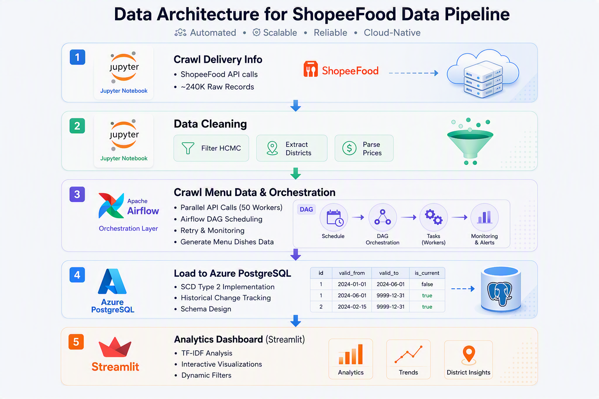
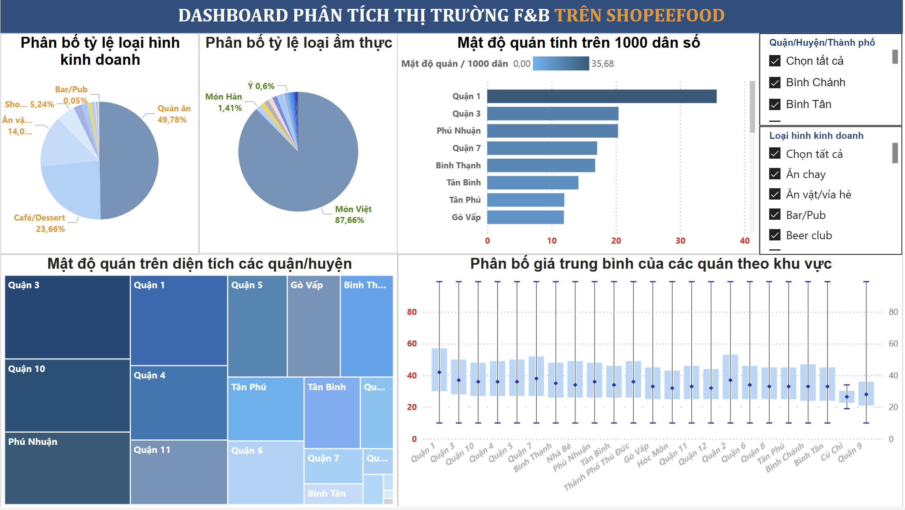
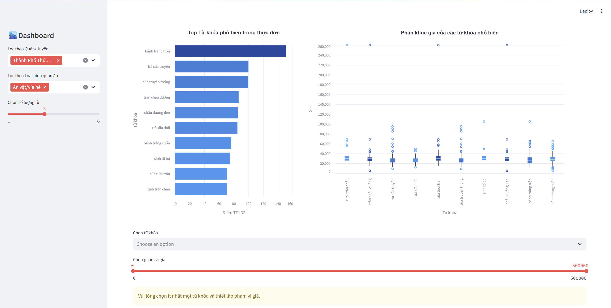
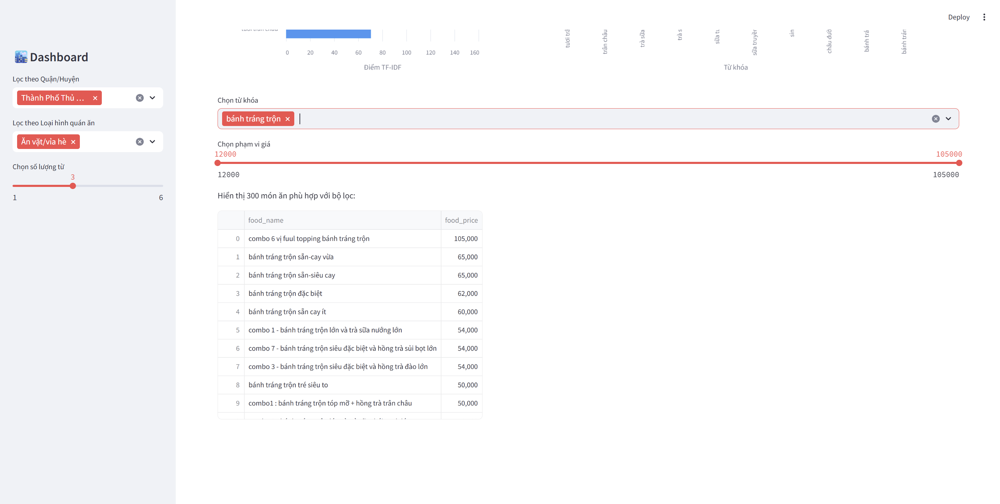

# Shopee Food Data Pipeline & Analytics

A comprehensive data engineering project that crawls restaurant and menu data from ShopeeFood (Vietnam's leading food delivery platform), stores it in Azure PostgreSQL, and provides interactive analytics dashboards.

## 🚀 Tech Stack


## 📌 Project Overview

This project collects, processes, and analyzes food delivery data from ShopeeFood to understand:

- Restaurant distribution across Ho Chi Minh City districts
- Menu trends and popular dishes using TF-IDF keyword analysis
- Price distribution patterns by cuisine and category
- Quality merchant insights



## 🗂️ Project Structure

```
Shopee_Food/
├── utils/
│   ├── __init__.py                # Python package marker for shared helpers
├── config.yml                     # PostgreSQL credentials and connection config
│   └── postgres.py                # Shared PostgreSQL connection helper
├── dags/
│   └── dag_shopee_food.py          # Airflow DAG for pipeline orchestration
├── dashboard/
│   └── streamlit.py                # Interactive analytics dashboard
├── data/
│   └── delivery_info_clean.csv     # Cleaned restaurant dataset
├── image/
├── notebook/
│   ├── clean_delivery_infos.ipynb  # Data cleaning & preprocessing
│   ├── crawl_delivery_infos.ipynb  # Crawl restaurant info from API
│   └── EDA.ipynb                   # Exploratory Data Analysis
├── sql-scripts/
│   └── create_table.sql            # Database schema creation
├── src/
│   ├── extraction/
│   │   └── crawl_menu.py           # Crawl menu/dish data from API
│   └── loading/
│       ├── insert_data.py          # Load restaurant data to PostgreSQL
│       └── insert_menu.py          # Load menu data to PostgreSQL
├── requirements.txt                # Python dependencies
└── README.md                       # Project documentation
```

## 🛠️ Technologies Used

### 📥 Data Collection

| Technology           | Purpose                                         |
| -------------------- | ----------------------------------------------- |
| `requests`           | HTTP library for API calls                      |
| `tenacity`           | Retry logic with exponential backoff            |
| `tqdm`               | Progress bars for batch processing              |
| `concurrent.futures` | Parallel request execution (ThreadPoolExecutor) |

### 🧹 Data Processing

| Technology     | Purpose                                     |
| -------------- | ------------------------------------------- |
| `pandas`       | Data manipulation and analysis              |
| `numpy`        | Numerical operations                        |
| `scikit-learn` | TF-IDF vectorization for keyword extraction |
| `ast`          | Python literal parsing for JSON strings     |

### 🗄️ Database

| Technology                        | Purpose                       |
| --------------------------------- | ----------------------------- |
| `psycopg2`                        | PostgreSQL adapter for Python |
| **Azure Database for PostgreSQL** | Cloud-hosted managed database |

### 🔁 Workflow Orchestration

| Technology         | Purpose                               |
| ------------------ | ------------------------------------- |
| **Apache Airflow** | Pipeline scheduling and orchestration |

### 📊 Data Visualization

| Technology   | Purpose                             |
| ------------ | ----------------------------------- |
| `streamlit`  | Web dashboard framework             |
| `matplotlib` | Statistical graphics                |
| `seaborn`    | Enhanced statistical visualizations |
| `plotly`     | Interactive charts                  |
| `altair`     | Declarative visualizations          |
| `wordcloud`  | Word frequency visualization        |

## 🧱 Database Schema

### 🧰 Tables

**restaurant** - Restaurant details

- `id`, `name`, `brand_id`, `cuisines`, `district`
- `latitude`, `longitude`, `category`, `avg_price`
- `is_quality_merchant`, `created_at`

**brand** - Brand information

- `brand_id`, `brand_name`

**review** - Customer ratings

- `restaurant_id`, `total_review`, `avg_review`

**menu** - Menu history with versioning

- `restaurant_id`, `menu_data` (JSON)
- `start_date`, `end_date`, `is_current`

## ✨ Features

- **Parallel Crawling**: 50 concurrent workers for efficient data collection
- **Retry Logic**: Automatic retry with exponential backoff for failed requests
- **Data Versioning**: Menu history tracking with `is_current` flag
- **TF-IDF Analysis**: Extract meaningful keywords from menu items
- **Interactive Dashboard**: Filter by district, category, price range, and keywords
- **Airflow Integration**: Automated pipeline orchestration

## 🖥️ Dashboard Preview

### Restaurant Dashboard



### Menu Dashboard - Overview



### Menu Dashboard - Analysis


